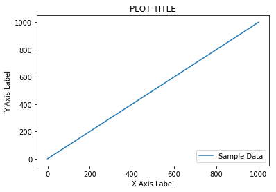
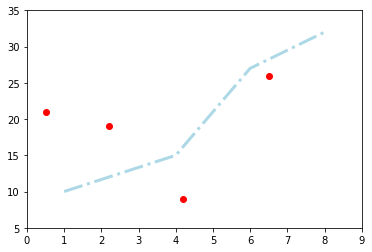
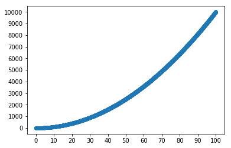
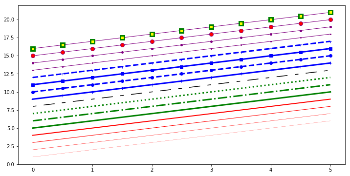
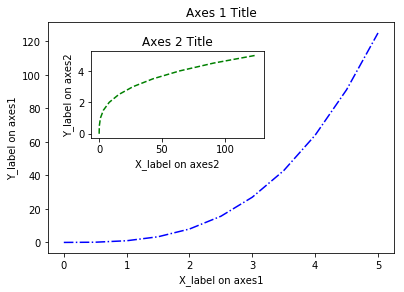

# Customizing Visualization with `matplotlib` 

## Objectives

* Understand matplotlib plot structure for customizing plots.
* Differentiate between absolute and relative plotting techniques.
* Implement and tweak high level objects in matplotlib including figure and axes.

## Introduction

We saw a quick introduction `matplotlib` plotting in the first section. This lesson covers plotting with Python and `matplotlib` using a more structured approach. We shall look into the components of standard matplotlib plots, used for creating and customizing visualizations. The lesson will also provide you with lots of example code to get you started with data visualization and customizations. 

## `matplotlib` Plot:

We have already seen some of the `matplotlib` built in functions that facilitate visualizing data with minimum effort. 

Let's first import matplotlib's `pyplot` module into our working environment along with `numpy` to create sample data. We can use numpy's `linspace()` function to quickly generate some dummy data for visualizations.`pyplot` module provides allows simple and agile creation of figures and axes to achieve the desired plot. We shall see below how required figure descriptions and axes are added in a simple example. 


```python
import matplotlib.pyplot as plt

# Import numpy to generate some dummy data
import numpy as np

# Create a numpy array of 100 values from 0 - 1000
data = np.linspace(0, 1000, 100)
data
```


    array([   0.        ,   10.1010101 ,   20.2020202 ,   30.3030303 ,
             40.4040404 ,   50.50505051,   60.60606061,   70.70707071,
             80.80808081,   90.90909091,  101.01010101,  111.11111111,
            121.21212121,  131.31313131,  141.41414141,  151.51515152,
            161.61616162,  171.71717172,  181.81818182,  191.91919192,
            202.02020202,  212.12121212,  222.22222222,  232.32323232,
            242.42424242,  252.52525253,  262.62626263,  272.72727273,
            282.82828283,  292.92929293,  303.03030303,  313.13131313,
            323.23232323,  333.33333333,  343.43434343,  353.53535354,
            363.63636364,  373.73737374,  383.83838384,  393.93939394,
            404.04040404,  414.14141414,  424.24242424,  434.34343434,
            444.44444444,  454.54545455,  464.64646465,  474.74747475,
            484.84848485,  494.94949495,  505.05050505,  515.15151515,
            525.25252525,  535.35353535,  545.45454545,  555.55555556,
            565.65656566,  575.75757576,  585.85858586,  595.95959596,
            606.06060606,  616.16161616,  626.26262626,  636.36363636,
            646.46464646,  656.56565657,  666.66666667,  676.76767677,
            686.86868687,  696.96969697,  707.07070707,  717.17171717,
            727.27272727,  737.37373737,  747.47474747,  757.57575758,
            767.67676768,  777.77777778,  787.87878788,  797.97979798,
            808.08080808,  818.18181818,  828.28282828,  838.38383838,
            848.48484848,  858.58585859,  868.68686869,  878.78787879,
            888.88888889,  898.98989899,  909.09090909,  919.19191919,
            929.29292929,  939.39393939,  949.49494949,  959.5959596 ,
            969.6969697 ,  979.7979798 ,  989.8989899 , 1000.        ])


Just as expected. 100 equally spaced numbers starting from 0 to a 1000. 

After preparing the the data, we can use matplotlib's `plot()` function to create the plot with our data, `legend()` to add context information to the plot, and finally `show()` functions to output the plot . 

In jupyter notebooks, you can use `%matplotlib` magic with `inline` to show plots inside the notebook or `qt` for external/interactive plots. `inline` is recommended for most needs. There is also a `% matplotlib notebook` magic, which we shall see shortly.


```python
# Set plot space as inline for inline plots and qt for external plots
%matplotlib inline

# Use plot() function to create a plot using above values on both x and y co-ordinates. Add a label.
plt.plot(data, data, label='Sample Data')

# Add a legend to the plot with legend()
plt.legend()

# Output the final plot
plt.show()
```





### Labelling the Plots

With a simple plot as shown above, `matplotlib` also allows users to provide a context to the visual information by adding plot titles and labels for axes. Following functions can be used to achieve this:

**`plt.xlabel("text") / plt.ylabel("text")`** - Define labels for x and y axes. 

**`plt.title("text")`** - Define the plot title. 

These functions can be used with the `.legend()` function as we just saw above to add legend to the plot. The legend function takes an optional keyword argument `loc` that can be used to specify where in the figure the legend is to be drawn. 

    ax.legend(loc=1) : upper right corner
    ax.legend(loc=2) : upper left corner
    ax.legend(loc=3) : lower left corner
    ax.legend(loc=4) : lower right corner

Lets add some more information to above plot using these functions below:


```python
# Set plot space as inline for inline plots and qt for external plots
%matplotlib inline

# Use plot() function to create a plot using above values on both x and y co-ordinates. Add a label.
plt.plot(data, data, label='Sample Data')

# Add labels for x and y axes
plt.xlabel('X Axis Label')
plt.ylabel('Y Axis Label')

# Add a title for the plot
plt.title('PLOT TITLE')

# Add a legend to the plot with legend() in lower right corner
plt.legend(loc=4)

# Output the final plot
plt.show()
```





## `matplotlib` Objects

As we just saw, such basic visualizations only require a few lines of code in `matplotlib` and `pyplot`. We have used a lot of built-in defaults that provide definitions of many underlying components. `figure` and `axes` are two such components which we shall discuss next. The structure of a plot in `matplotlib` can be generalized as shown below.  


### Figure and Axes Objects
Looking at the above image, a **figure** is a top level component that refers to the overall image space. **Axes** are added to the figure to define the area where data is plotted with the `plot()` function seen above. A figure can have a number of components like **title(s)** and **legend(s)** which may be used to further explain and customize the plot.  Axes have **ticks** and **labels** providing a perspective to the plot. `set_xlim(min,max)` and `set_ylim(min,max)` are used to define the limits of axes in a plot. 

Let's see all of above in action with another plot. Here we shall declare a new figure space by calling `.figure()` method and use random data values to draw a line graph and a scatter plot using same axes i.e. draw plots on top of each other. We shall set the limits of x and y dimensions and output the final plot. 


```python
# Define a new figure with matplotlib's .plot() function. 
new_figure = plt.figure()

# Add a subplot to the figure - a new axes
ax = new_figure.add_subplot(111)

# Generate a line plot 
ax.plot([1, 4, 6, 8], [10, 15, 27, 32], color='lightblue', linewidth=3, linestyle = '-.')

# Draw a scatter plot on same axes
ax.scatter([0.5, 2.2, 4.2, 6.5], [21, 19, 9, 26], color='red', marker='o')

# Set the limits of x and y for axes
ax.set_xlim(0, 9), ax.set_ylim(5,35)

# Show the plot
plt.show()
```





### Sub-Plots
If you want to draw a single plot, it’s better to do it with defaults as we saw in the first example. However, if you want to draw multiple axes i.e. multiple plots in a single figure, it’s always better to explicitly define the **figure** object. Folowing this, you will always make use of the **Axes** object as `ax` above.

We used `add_subplot()` function above as `add_subplots(111)` to define a new axes. This function took 3 arguments: number of rows (1), the number of columns (1) and the plot number (1), i.e. a single plot.

Let's re-draw above plots in two different subplots. For this, we shall pass the arguments (12x) - telling us that we have one row split into two columns.  We can replace x with 1 and 2 to address our subplots areas. We shall also pass `figzie =(x,y)` to `.figure()` function in order to define the size for our figure space (x and y values are in inches by deualt).


```python
# Define a new figure with matplotlib's .plot() function. Set the size of figure space
new_figure = plt.figure(figsize=(10,4))

# Add a subplot to the figure - a new axes
ax = new_figure.add_subplot(121)

# Add a second subplot to the figure - a new axes
ax2 = new_figure.add_subplot(122)

# Generate a line plot on first axes
ax.plot([1, 4, 6, 8], [10, 15, 27, 32], color='lightblue', linewidth=3, linestyle = '-.')

# Draw a scatter plot on 2nd axes
ax2.scatter([0.5, 2.2, 4.2, 6.5], [21, 19, 9, 26], color='red', marker='o')

# Set the limits of x and y for first axes
ax.set_xlim(0, 9), ax.set_ylim(5,35)

# Set the limits of x and y for 2nd axes
ax2.set_xlim(0, 9), ax2.set_ylim(5,35)

# Show the plot
plt.show()


```





We can also draw above as one column split into two rows by passing (21x) to add_subplot function. Wanna give it a try ?

### `add_sublpot()` vs. `add_axes()` Functions

The `fig.add_axes()` and `fig.add_subplot()` both return a new Axes object. However, they do differ in the mechanism for adding the axes. With `add_axes()`, axes object is positioned in absolute coordinates, whereas with `add_subplot()`, axes objects are positined relatively as we saw above. `add_axes()` can therefore be used for visualizing a plot within a plot. Let's look at a quick example:


```python
# Generate sample data 
x = np.linspace(0, 5, 11)
y = x ** 3

# Creates blank canvas
figure = plt.figure()

# Add new axes to the figure with absolute positions
ax1 = figure.add_axes([0.1, 0.1, 0.8, 0.8]) # main axes
ax2 = figure.add_axes([0.2, 0.5, 0.4, 0.3]) # inset axes

# Larger Figure Axes 1
ax1.plot(x, y, color = 'blue', linestyle = '-.')
ax1.set_xlabel('X_label on axes1')
ax1.set_ylabel('Y_label on axes1')
ax1.set_title('Axes 1 Title')

# Insert Figure Axes 2
ax2.plot(y, x, color = 'green', linestyle = '--')
ax2.set_xlabel('X_label on axes2')
ax2.set_ylabel('Y_label on axes2')
ax2.set_title('Axes 2 Title')

plt.show()
```





### Customizing Line Styles

The functions shown above take additional parameters line `color`, `linewidth`, `linestyle` and `marker` etc. for customization of plots and to "prettify" them. A complete list of arguments that work with these plotting functions can be viewed at [Official Documentation](https://matplotlib.org/api/_as_gen/matplotlib.pyplot.plot.html).

To change the line width, we can use the `linewidth` or `lw` keyword argument. The line style can be selected using the `linestyle` or `ls` keyword arguments. Following plot summarizes different types of lines you can draw in matplotlib.


```python
fig, ax = plt.subplots(figsize=(12,6))

ax.plot(x, x+1, color="red", linewidth=0.25)
ax.plot(x, x+2, color="red", linewidth=0.50)
ax.plot(x, x+3, color="red", linewidth=1.00)
ax.plot(x, x+4, color="red", linewidth=2.00)

# possible linestype options ‘-‘, ‘–’, ‘-.’, ‘:’, ‘steps’
ax.plot(x, x+5, color="green", lw=3, linestyle='-')
ax.plot(x, x+6, color="green", lw=3, ls='-.')
ax.plot(x, x+7, color="green", lw=3, ls=':')

# custom dash
line, = ax.plot(x, x+8, color="black", lw=1.50)
line.set_dashes([5, 10, 15, 10]) # format: line length, space length, ...

# possible marker symbols: marker = '+', 'o', '*', 's', ',', '.', '1', '2', '3', '4', ...
ax.plot(x, x+9, color="blue", lw=3, ls='-', marker='+')
ax.plot(x, x+10, color="blue", lw=3, ls='--', marker='o')
ax.plot(x, x+11, color="blue", lw=3, ls='-', marker='s')
ax.plot(x, x+12, color="blue", lw=3, ls='--', marker='1')

# marker size and color
ax.plot(x, x+13, color="purple", lw=1, ls='-', marker='o', markersize=2)
ax.plot(x, x+14, color="purple", lw=1, ls='-', marker='o', markersize=4)
ax.plot(x, x+15, color="purple", lw=1, ls='-', marker='o', markersize=8, markerfacecolor="red")
ax.plot(x, x+16, color="purple", lw=1, ls='-', marker='s', markersize=8, markerfacecolor="yellow", markeredgewidth=3, markeredgecolor="green");
```


### Basic Plotting functions in `matplotlib`

In the plots above, we saw `ax.scatter()` for generating a scatter plot and `ax.plot()` function for the line plot. It is imperative that data in the right format and dimensions is passed to these functions to avoid any errors or unexpected behaviour in the output. Following is a list of other simiar functions which can be readily used for visualizing data. 

    .plot()           Line plot
    .scatter()        Scatter plot
    .bar()	        Vertical bar graph
    .barh()	       Horizontal bar graph
    .axhline()	    Horizontal line across axes
    .vline()	      Vertical line across axes
    .stackplot()	  Stack plot
    
We shall look into these functions in detail in upcoming labs and lessons. 

## Summary

This lesson provided us with an introduction to plotting in `matplotlib` plotting library. We saw how to draw plots with default objects settings vs. plotting with object definitions. We learnt to apply labels and titles to the plots to provide them context for an improved understanding. The lesson provided ways to draw multiple plots within the same figure by using absolute and relative definitions. The lesson ended by providing a quick reference list to some styling techniques and further plotting functions which will be discussed in detail later. 

